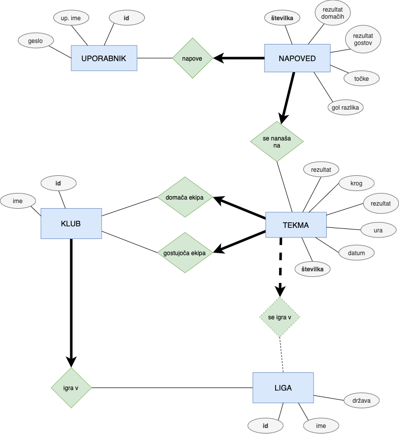
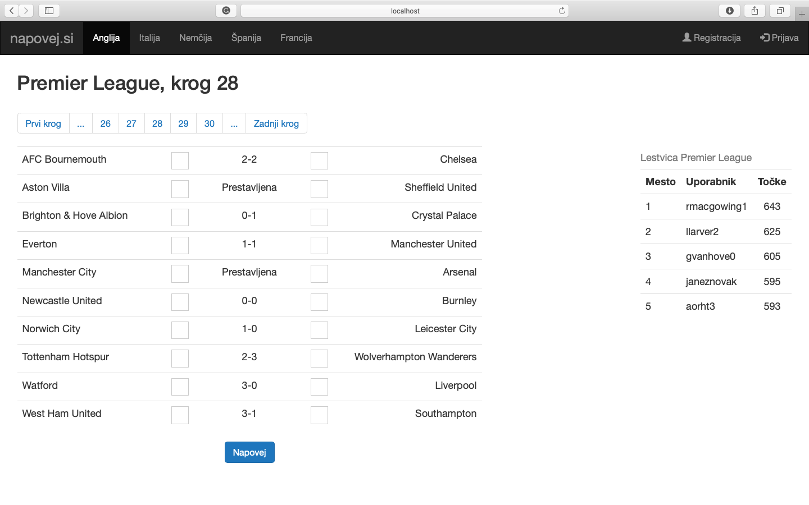

# Napovedi

Projekt pri OPB - napovedi nogometnih tekem.

# 1. faza

## Pridobitev podatkov

Naša baza bo vključevala 5 entitet:
- uporabniki,
- lige,
- klubi,
- tekme,
- napovedi.

Povezava med entitetami je predstavljena v ER diagramu v nadaljevanju.

Tabela zajem-in-obdelava/obdelani-podatki/lige.csv je bila ustvarjena ročno.

Klubi in tekme bodo iz 5 najmočnejših evropskih nogometnih lig (Anglija, Španija, Nemčija, Italija, Francija). Te podatke smo črpali iz spletne strani [soccerway.com](https://int.soccerway.com). Zajem spletnih strani je narejen z datotekami:
- zajem-in-obdelava/zajem_klubi.py in
- zajem-in-obdelava/zajem_tekme.py.

Spletne strani so shranjene v direktoriju zajem-in-obdelava/spletne-strani (klubi) in zajem-in-obdelava/spletne-strani tekme. Obdelava (branje podatkov iz spletnih strani s pomočjo regularnih izrazov) je narejen z datotekami:
- zajem-in-obdelava/obdelava_klubi.py in
- zajem-in-obdelava/obdelava_tekme.py.

Pri zajemu, obdelavi in shranjevanju podatkov sem si pomagal z datoteko orodja.py (avtor: dr. Matija Pretnar).

Uporabnike smo generirali na spletni strani [mockaroo.com](https://www.mockaroo.com).

Napovedi smo generirali z datoteko zajem-in-obdelava/generiranje.py s pomočjo normalne porazdelitve.

Obdelani podatki so shranjeni v direktoriju zajem-in-obdelava/obdelani-podatki v obliki CSV datotek.

## Zasnova podatkovne baze in ER diagram

Entitete smo našteli že prej, povezave med njimi pa si poglejmo na ER diagramu.

## Načrt za aplikacijo

Uporabnik se bo prijavil z uporabniškim imenom in geslom. Nato bo lahko napovedal rezultate tekem. Napovedi se bodo točkovale glede na dejanski rezultat. Uporabnik bo imel torej v eni ligi določeno število točk, kar ga bo uvrstilo na lestvico vseh aktivnih uporabnikov v tej ligi. Aplikacijo lahko izkoristimo za tekmovanje med prijatelji, zadnji časti pivo in pico. :)

